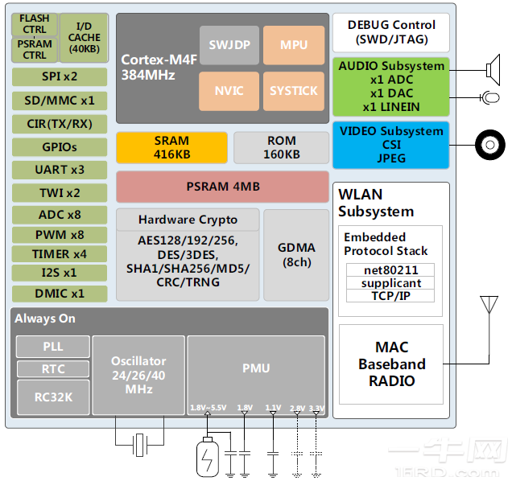

# [XR872](https://doc.soc.xin/XR872)

* [Xradio](http://www.xradiotech.com/): [Cortex-M4F](https://github.com/SoCXin/Cortex)
* [L4R4](https://github.com/SoCXin/Level): 384 MHz + 240 MHz

## [简介](https://www.espressif.com/en/news/XR872)

[XR872](https://github.com/XradioTech) 应用子系统由运行频率高达 384MHz 的 ARM Cortex-M4F CPU 供电。它支持一个集成的 416KB SRAM 和 160KB ROM、一个到 16MB 闪存的 SIP 的 QSPI 接口、一个到 SIP 4MB PSRAM 的 OPI 接口。集成 I-cache 支持从闪存和 PSRAM 就地执行 (XIP)，集成 D-cache 支持从 PSRAM 读取和写入。它还包括许多外设，包括 UART、TWI、SPI、DMIC、AUDIO CODEC、PWM、CIR (T/R)、CSI、SDIO 和辅助 ADC。

Wi-Fi 子系统包含 802.11b/g/n 基带、MAC 和带有集成 PA、LNA、开关和谐波滤波器的无线电，旨在满足低功耗、高集成度和高​​性能网络应用。使用XRADIOTECH的MPDTM技术设计了一种新颖的数字射频发射器，以提供更高的输出功率并保持更高的效率，同时保持芯片对天线失配不敏感，但在不同的VSWR下始终具有良好的EVM。

### 关键参数

* 384 MHz + 240 MHz Cortex-M4F
* 416KB SRAM 和 160KB 代码 ROM
* IEEE 802.11b/g/n，1x1 SISO 2.4GHz

#### Audio

* 1个带左右声道语音输入的数字麦克风控制器
* 1个24bit音频数模（DAC）通道，支持从8KHz到192KHz的采样率
* 1个24bit音频模数（ADC）通道用于麦克风输入，支持从8KHz到48KHz的采样率
* 1个24bit音频到数字（ADC）通道用于线路输入，支持从8KHz到48KHz的采样率

### [资源收录](https://github.com/SoCXin)

* [参考资源](src/)
* [参考文档](docs/)
* [参考工程](project/)

### [选型建议](https://github.com/SoCXin/XR872)

[XR872](https://github.com/SoCXin/XR872) 

### [www.SoC.xin](http://www.SoC.Xin)
